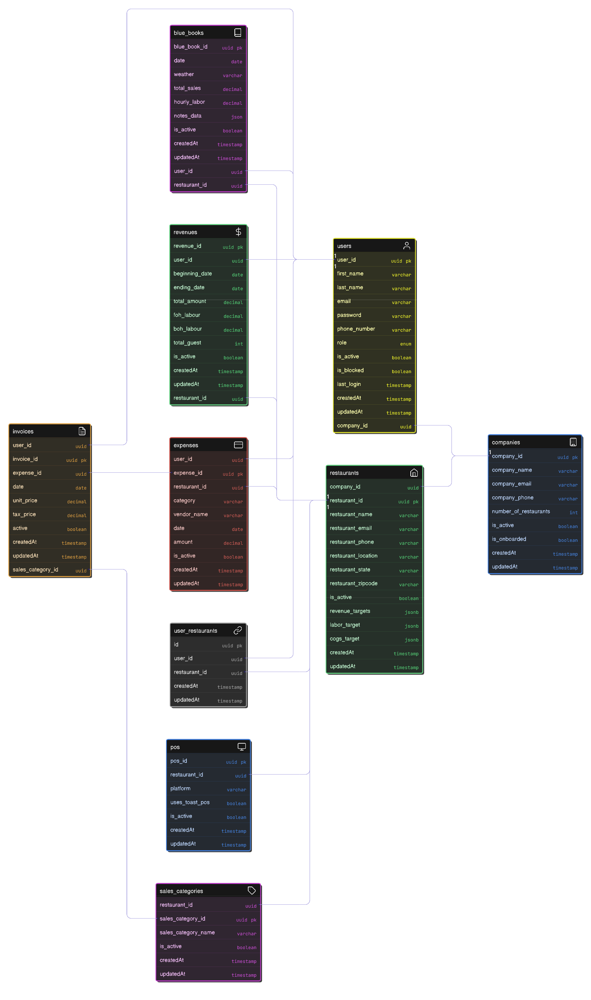

# ⚙️ Restaurant Operations Backend

> **Enterprise-Grade Multi-Tenant API Layer** - A high-performance, scalable Node.js backend powering the Restaurant Operations Dashboard with robust RBAC and PostgreSQL optimization.

[](https://nodejs.org/)
[](https://expressjs.com/)
[](https://sequelize.org/)
[](https://www.postgresql.org/)
[](https://supabase.com/)
[](https://jwt.io/)
[](https://render.com/)

---

## 🚀 Live Demo

Experience the dashboard instantly without manual configuration:
- **URL**: [Live Application Link](https://role-based-analytics-dashboard.vercel.app/) 
- **Demo Accounts**:
    - **Company Admin**: `demo_admin@dashboard.com` | `password123`
    - **Employee**: `demo_employee@dashboard.com` | `password123`

---

## 📖 Overview

The **Restaurant Operations Backend** is the core intelligence layer for a sophisticated multi-tenant SaaS application. It manages complex role-based access control, restaurant data isolation, and detailed financial tracking (Revenue, Expenses, BlueBook P&L) for restaurant groups.

Engineered for **security and developer experience**, it utilizes an optimized Sequelize ORM layer compatible with both local PostgreSQL and cloud-native solutions like Supabase.

---

## ✨ Key Features

### 🏦 Multi-Tenant Security
- **Domain-Isolated Data**: Strict company-level and restaurant-level data isolation.
- **Advanced RBAC**: Granular permissions for `Super_Admin`, `Company_Admin`, and `Restaurant_Employee`.
- **JWT Authentication**: Secure, stateless session management with token-based authorization.

### 🍽️ Operational Intelligence
- **BlueBook Engine**: Sophisticated logging system for daily operational notes and P&L data.
- **Financial Tracking**: Specialized modules for complex invoice management and revenue entry.
- **Hierarchy Mapping**: Deep relationship mapping between Users, Companies, and Restaurants.

### 🛠️ Production Ready
- **Auto-Sync Logic**: Smart database synchronization for accelerated development.
- **Error Orchestration**: Centralized global error handling and validation middleware.
- **Free-Tier Optimized**: Highly efficient resource usage designed for zero-cost hosting environments.

---

## 🛠 Tech Stack

| Layer | Technologies |
| :--- | :--- |
| **Runtime** | Node.js 18+ |
| **Framework** | Express.js |
| **Database** | Supabase (PostgreSQL 15) |
| **ORM** | Sequelize |
| **Auth** | JWT / bcrypt |
| **Validation** | express-validator |
| **Security** | Helmet, CORS, Compression |

---

## 📊 Database Schema

Detailed entity-relationship mapping for core modules (Users, Restaurants, Financials, and Operational logs).



---

## 📂 Project Architecture

```bash
backend_folder/
├── src/
│   ├── config/            # Database initialization
│   ├── controllers/       # Request handlers & Business logic
│   ├── middleware/        # Auth (RBAC), Validation, Error handling
│   ├── models/            # Sequelize schema definitions
│   ├── routes/            # Modular endpoint definitions
│   ├── services/          # Data access layer & Complex logic
│   └── seeders/           # Initial data population
├── server.js              # Application entry point
├── package.json           # Dependency manifest
└── .env.example           # Environment blueprint
```

---

## 🚀 Quick Start

### 📋 Prerequisites
- **Node.js** 18.x or later
- **Docker** installed and running
- **Git** (for cloning the repository)
- **PostgreSQL** 14+ (if not using Docker)

## 🗄️ Database Setup

### Option A: Using Supabase (Recommended for Production)
1. Create a project at [Supabase](https://supabase.com/).
2. Copy your **Transaction Connection String** or **Session Connection String** from the Database settings.
3. Add it to your `.env` file as `DATABASE_URL`.

### Option B: Local PostgreSQL (Using Docker)
If you prefer to run the database locally:

#### Step 1: Create PostgreSQL Container
Run this command to create a new PostgreSQL container:
```bash
docker run --name RBAC_Dashboard-postgres -e POSTGRES_PASSWORD=postgres -p 5432:5432 -d postgres:15-alpine
```

### Step 2: Create Development Database
Once the container is running, create the database:
```bash
docker exec -it RBAC_Dashboard-postgres psql -U postgres -c "CREATE DATABASE rbac_dashboard_dev;"
```

✅ You only need to run these commands **once** during initial setup!

---

## 🚀 Super Admin Account
When you start the server for the first time, a Super Admin account will be created automatically:

**Credentials:**
- **Email**: `superAdmin@dashboard.com`
- **Password**: `**********`
- **Role**: `Super_Admin`

> ⚠️ **Security Note**: Change this password in production! This is a default development account.

---

## 🏃 Daily Development Workflow

### 1. Start the Database
```bash
docker start breadcrumbs-postgres
```

### 2. Basic Installation
```bash
# Navigate to backend and install dependencies
cd backend_folder
npm install
```

### 3. Setup Environment
```bash
cp .env.example .env
# Configure JWT_SECRET and ensure DATABASE_URL points to localhost:5432
```

### 4. Running Locally
```bash
# Start development server
npm run dev

# 🧪 Seed Demo Data
# Populate the database with 30 days of realistic history for all modules
npm run seed:demo

# Run migrations (Optional)
npm run migrate
```
Server runs at `http://localhost:8080`.

---

## 📝 API Overview (v1)

### 🔐 Auth & Identity
- `POST /api/v1/users/signin` - Secure authentication.
- `GET /api/v1/users` - User directory (Admin only).

### 🏢 Tenant Management
- `POST /api/v1/companies` - Onboarding entry point.
- `PATCH /api/v1/onboarding/onboard/:id` - Global approval (Super Admin).

### 📊 Financial Operations
- `GET /api/v1/restaurants/revenue/all` - Centralized sales tracking.
- `POST /api/v1/expense` - Smart expense/invoice ingestion.
- `GET /api/v1/blue-book/:restaurant_id/:date` - P&L operational logs.

---

## 👨💻 Author - **Anoop Kumar**
- **GitHub**: [@Anoop-Kumar-31](https://github.com/Anoop-Kumar-31)
- **Portfolio**: [Anoop Kumar Portfolio](https://myportfolio-kto7.onrender.com/)

---
*Created for portfolio demonstration purposes.*
